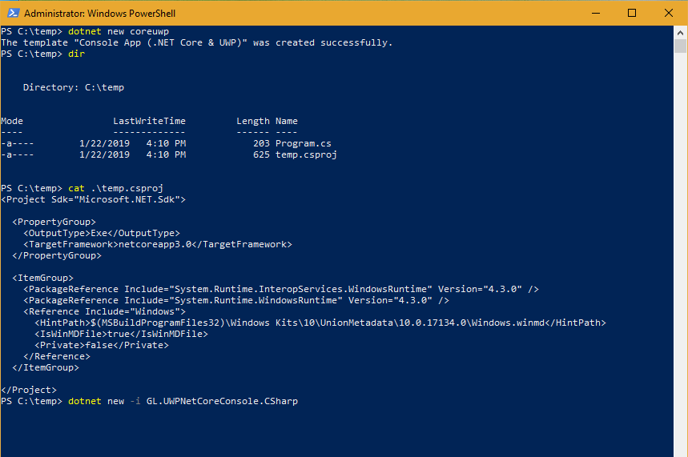

# Overview
A dotnet new project template for .NET Core 3.0 Console Apps referencing the Universal Windows Platform APIs.  
To install this template into the .NET CLI simply type the following command:  

`C:\myProject> dotnet new -i GL.UWPNetCoreConsole.CSharp`  

Then use it right away with  

`C:\myProject> dotnet new coreuwp` 

## Requirements
In order for you to load this porject inside Visual Studio, you need to use the Preview version available [here](https://visualstudio.microsoft.com/vs/preview/).  
Currently, this project template references the Windows SDK 10.0.17134.0.

## Preview

